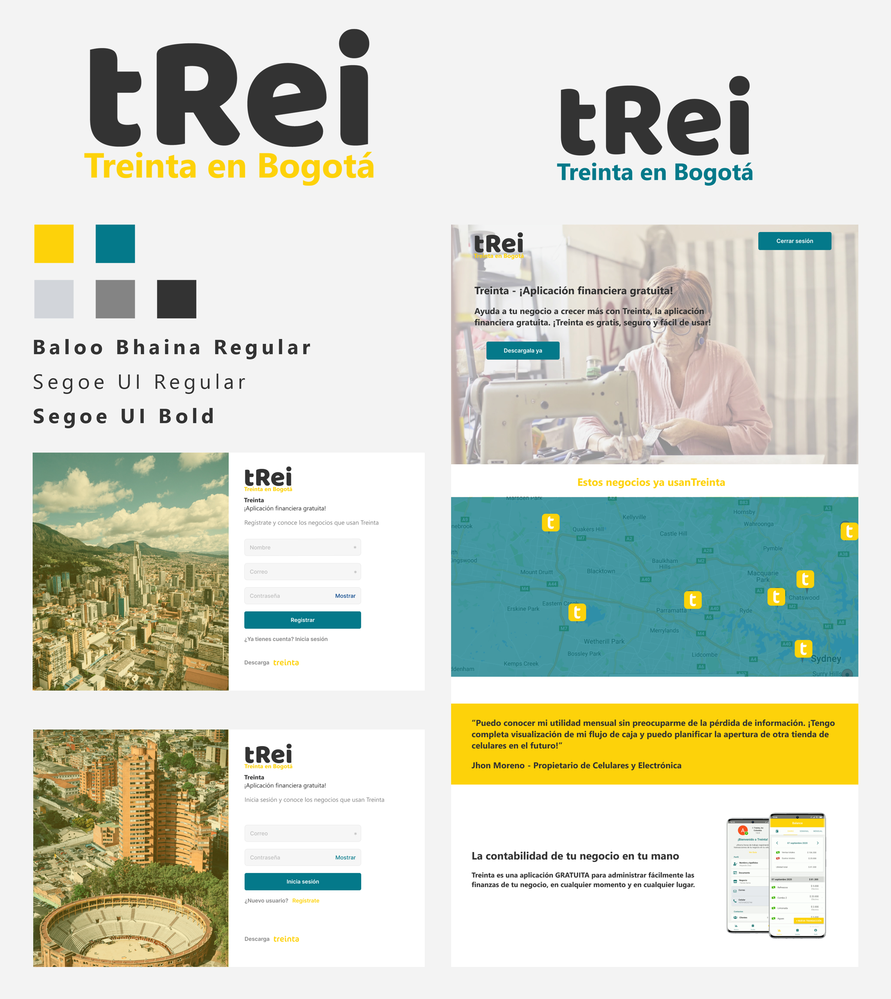

[Proyecto desplegado](https://trei-bogota.surge.sh)

# Tecnologias usadas

<div style="display:flex">
    <figure style="width:100px">
        
        <caption>React 17</caption>
    </figure>
    <figure style="width:100px">
        
        <caption>Sass</caption>
    </figure>
    <figure style="width:100px">
        
        <caption>Firebase</caption>
    </figure>
    <figure style="width:100px">
        
        <caption>Google maps API</caption>
    </figure>
</div>

# Proceso de diseño.

<figure>
    
</figure>

# Pasos para correr el repositorio en local

Paso 1: 
```sh
$ git clone git@github.com:soydulceangelina/tRei.git
```

Paso 2:
```sh
$ npm install
```

Paso 3: <br/><br/>
Crea un archivo .env en la raiz del proyecto, allí crea dos variables de entorno:
- REACT_APP_GOOGLE_MAPS_KEY, con tu Google Maps API Key
- REACT_APP_FIRE_KEY, con tu Firebase Key

Paso 4:
```sh
$ npm start
```

# Como subir el proyecto a produccion

```sh
npm run deploy:nodomain
```
